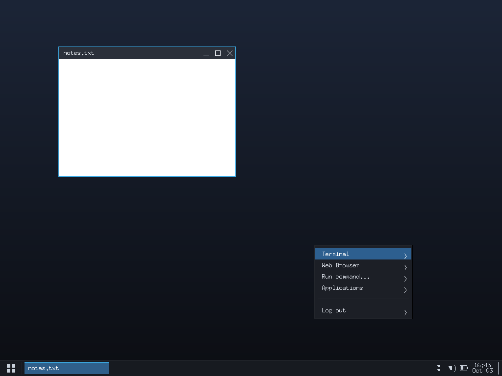
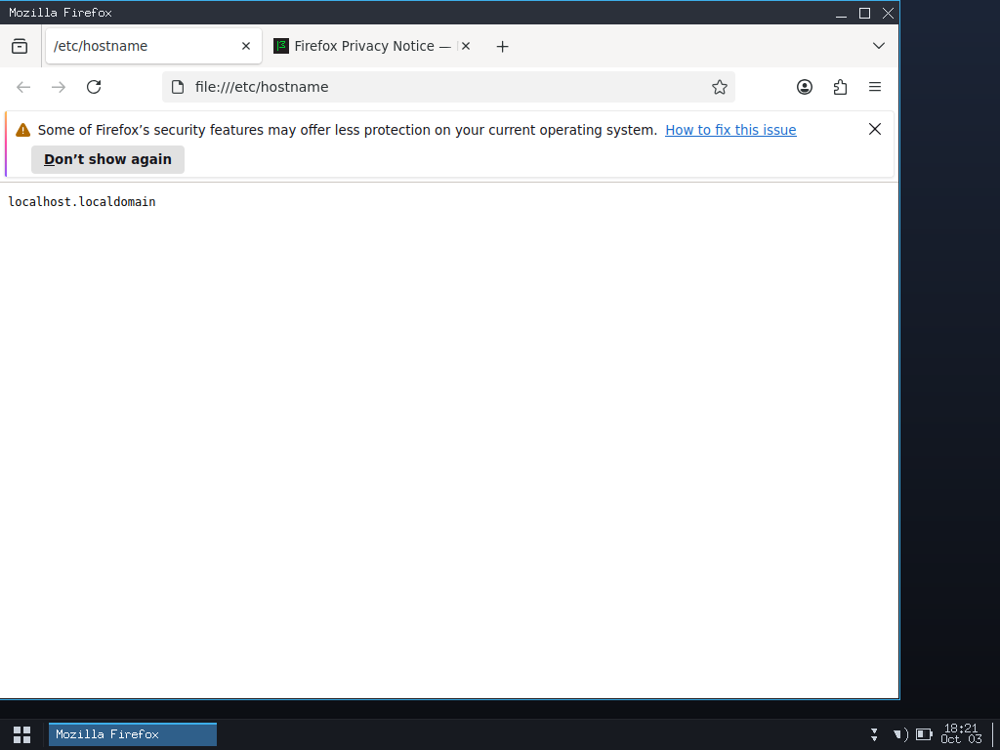
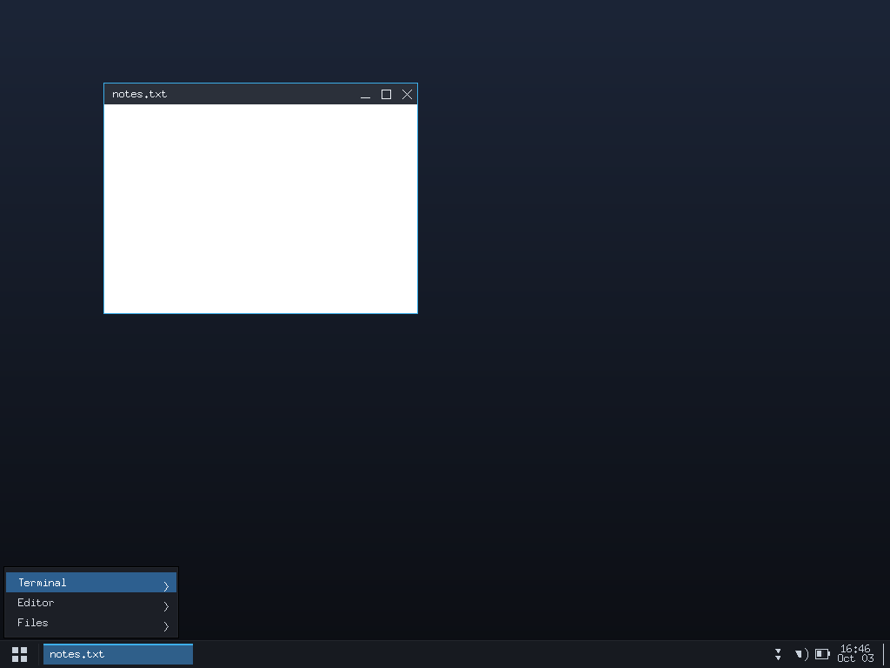

# SCDE — Solo Coding Desktop Environment
## Screenshots

### Desktop


### Firefox


### Application Menu

SCDE (version 0.2) is a lightweight window manager / desktop environment written
from scratch in **C11 + Xlib** and built with a plain **Makefile**. One
event-driven process: no busy polling, no threads, no daemons, no
GTK/Qt/Electron, no compositor.

The goal is a small, readable, self-contained desktop that is pleasant to use
on modest hardware — initially an **ARM64** phone running Ubuntu under PRoot
with **Termux:X11** as the X server, and portable to ordinary Linux desktops.

```
$ ldd scde
    libX11.so.6 => ...
    libc.so.6 => ...
```

Only `libX11` and libc are required at run time.

---

## Current Status

### Implemented

* **Window management** — reparenting title-bar frames, focus-follows-mouse,
  `Alt`+drag move, `Alt`+right-drag / 5 px edge resize, title-bar
  min/max/close buttons, double-click title to maximize, `Alt+Up`/`Alt+Down`,
  half-screen snap, `Alt+Tab` / `Shift+Alt+Tab`, `Alt+F4`, `Alt+D`
  (show desktop), `_NET_WM_STATE_FULLSCREEN`, `ConfigureRequest` handling.
* **Panel** — launcher button, task buttons with an active accent, two-line
  clock, show-desktop strip, three decorative status glyphs
  (network / volume / battery).
* **Application menu** — pinned entries plus every
  `/usr/share/applications/*.desktop`, scrollable, `Alt+Space`.
* **Command launcher** — `Alt+F2`, runs a command or opens a URL in the
  detected browser.
* **Desktop menu** — right click on the wallpaper (Terminal, Browser, Run…,
  Applications, Log out).
* **Message dialogs** — including the Plasma-style "program not installed"
  notice instead of failing silently.
* **Built-in file manager** — `Alt+E`: navigate, open, rename (`F2`),
  delete (confirmed), new folder (`Ctrl+N`), hidden files (`Ctrl+H`),
  right-click menu (Open / Rename / Delete / Properties / Set as wallpaper).
* **Media** — files are classified by extension and opened with an installed
  viewer: images → `feh`, video/music → `mpv`; `wallpaper=` in the config
  loads a background image.
* **Configuration** — `~/.config/scde/config`, plain `key=value`, unknown keys
  reported and ignored, built-in defaults when the file is missing.
* **Lifecycle** — single-instance `fcntl` lock, clean shutdown on
  `SIGINT`/`SIGTERM`/`SIGHUP` with clients reparented back to the root.
* **Test suite** — 74 automated checks on Xvfb plus three small X test
  clients.
* **HAL** — a separate, dependency-free static library (`hal/libhal.a`)
  with GPU / Bluetooth / Audio APIs, Linux and Android backends, and its own
  182-check smoke test.

### In Development

* **HAL ↔ desktop integration.** The library builds, is tested, and detects
  this device's hardware, but `src/` does not link it yet. The panel's status
  glyphs are still drawn from fixed shapes, not from HAL data.

### Planned

Not implemented yet — see [Roadmap](#roadmap).

* Built-in terminal emulator
* Built-in text editor
* Settings UI (configuration is file-only today)
* Notification service
* Clipboard
* Power management
* Real system tray (`_NET_SYSTEM_TRAY` / XEmbed)
* Network and device integration wired to real status data

---

## Features

| Area | Behaviour |
|---|---|
| Look | Plasma-style: reparented frame windows, gradient wallpaper, title bar with min/max/close, hover states, double-click title = maximize |
| Window management | MapRequest, ConfigureRequest, DestroyNotify, UnmapNotify, focus-follows-mouse, fullscreen via `_NET_WM_STATE_FULLSCREEN` |
| Move | `Alt` + Left-drag, or drag the title bar |
| Resize | `Alt` + Right-drag, or drag a window edge (5 px) |
| Close | `Alt+F4`, the title-bar ✕ (WM_DELETE_WINDOW, else XKillClient) |
| Maximize / minimize | `Alt+Up` toggle, `Alt+Down`, title-bar □ / ▬ |
| Snap | `Alt+Left` / `Alt+Right` half screen |
| Show desktop | `Alt+D` or the strip at the far right of the panel |
| Switch windows | `Alt+Tab`, `Shift+Alt+Tab` (wraps) |
| Panel | launcher icon, task buttons (active accent), decorative status glyphs, two-line clock |
| App menu | pinned entries + every `/usr/share/applications/*.desktop`, scrollable, `Alt+Space` or the launcher button |
| Program detection | terminal / editor / browser picked from `PATH` (or your `terminal=`, `browser=` config); built-in menu entries are `@terminal`, `@editor`, `@files`, `@browser`, `@apps`, `@run`, `@desktop`, `@logout` |
| Missing program | a Plasma-style notice dialog tells you what to install instead of failing silently |
| Desktop menu | right click on the wallpaper: Terminal, Browser, Run…, Applications, Log out |
| Command launcher | `Alt+F2` — runs a command, or opens a URL (`example.com`, `https://…`) in the detected browser |
| Terminal | `Alt+Enter` (configurable) — starts the detected external terminal |
| File manager | `Alt+E` — built in: navigate, rename (F2), delete, new folder, right-click menu, hidden files (Ctrl+H) |
| Media | photos open with feh, video/music with mpv; `wallpaper=` in the config sets the background |
| Config | `~/.config/scde/config` (key=value) |
| Shutdown | clean `SIGINT`/`SIGTERM`/`SIGHUP` handling, clients reparented back to the root |
| Single instance | `fcntl` lock file in `$XDG_CACHE_HOME/scde` (auto-released on crash) |

Extra: `_NET_ACTIVE_WINDOW`, `_NET_CLIENT_LIST`, `_NET_SUPPORTED`,
`_NET_SUPPORTING_WM_CHECK`, `WM_STATE`, window title tracking on the panel.

---

## Architecture

```
scde/
├── Makefile                 top-level build (this is what `make` runs)
├── README.md
├── config/
│   └── scde-config.sample   annotated configuration template
├── src/                     the desktop itself — one process
│   ├── scde.h               shared types, config struct, prototypes
│   ├── main.c               X connection, setup, poll() loop, signals, lock
│   ├── wm.c                 client list, frame windows, focus, close, drag
│   ├── input.c              key/button grabs, Alt-drag, desktop clicks
│   ├── panel.c              panel, task buttons, clock, status glyphs
│   ├── launcher.c           application menu + Alt+F2 prompt
│   ├── fm.c                 built-in file manager
│   ├── apps.c               program detection, launch helpers, media
│   ├── msgbox.c             modal message dialogs
│   ├── config.c             config parser
│   └── util.c               logging, spawn, colours, text helpers
├── hal/                     separate hardware abstraction library
│   ├── Makefile             builds libhal.a + its two tools
│   ├── include/hal/         hal.h, gpu.h, bluetooth.h, audio.h
│   ├── src/                 generic module logic (hal.c, gpu.c, ...)
│   │   ├── backends/linux/    DRM sysfs, rfkill/HCI, ALSA
│   │   └── backends/android/  Android detection + property/sysfs readers
│   └── tests/               hal_smoke.c (182 checks), hal_info.c
├── tests/                   X11 test suite
│   ├── run_tests.sh         74 checks on Xvfb (timeout-guarded by make)
│   ├── testclient.c         minimal X client used by the suite
│   ├── rootpixel.c          reads the root window pixel
│   ├── screenshot.c         dumps the root window as PPM
│   └── shoot.sh             one-shot screenshot helper
└── screenshot*.png          captured example sessions
```

Build artifacts (all removed by `make clean`):

| Path | Produced by |
|---|---|
| `build/src/*.o`, `*.d` | `make` (release objects + auto header deps) |
| `scde` | `make` |
| `tests/testclient`, `tests/rootpixel`, `tests/screenshot` | `make` |
| `build-debug/`, `scde-debug` | `make debug` |
| `hal/src/**/*.o`, `hal/libhal.a`, `hal/tests/hal_smoke`, `hal/tests/hal_info` | `make hal` / `make test` |

`src/` and `hal/` are **independent**: the desktop does not link the HAL.
There is no `configure` script, no generated sources, and no submodules.

---

## HAL

`hal/` is a standalone C11 static library (`libhal.a`) with **no external
dependencies** — only libc and kernel UAPI headers. It is built and tested by
its own Makefile; the top-level `make test` drives it.

### Modules and generic API

| Module | Header | Capabilities |
|---|---|---|
| GPU | `hal/gpu.h` | `HAL_GPU_CAP_RENDER`, `HAL_GPU_CAP_MODESET`, `HAL_GPU_CAP_SOFTWARE` |
| Bluetooth | `hal/bluetooth.h` | `HAL_BT_CAP_ADAPTER`, `HAL_BT_CAP_POWER`, `HAL_BT_CAP_DISCOVERY` |
| Audio | `hal/audio.h` | `HAL_AUDIO_CAP_PLAYBACK`, `HAL_AUDIO_CAP_CAPTURE`, `HAL_AUDIO_CAP_MIXER`, `HAL_AUDIO_CAP_PULSE` |

Generic lifecycle and discovery in `hal/hal.h`:

```c
hal_status_t hal_init(const hal_init_opts_t *opts);
void         hal_shutdown(void);
bool         hal_is_inited(void);
bool         hal_is_android(void);
bool         hal_module_available(hal_module_t module);
uint32_t     hal_available_mask(void);
hal_status_t hal_module_get_info(hal_module_t module, hal_module_info_t *out);
```

plus per-module calls such as `hal_gpu_primary()`,
`hal_bluetooth_adapter_count()`, `hal_audio_device_count()`,
`hal_audio_get_master_volume()`, `hal_bluetooth_set_powered()`.

### Backends and hardware detection

* **Linux backend** — GPU from `/sys/class/drm` (vendor/device/driver/VRAM),
  Bluetooth from `/dev/rfkill` + HCI, audio from `/proc/asound` and `/dev/snd`.
* **Android backend** — selected when `/system/build.prop`,
  `/system/bin/app_process64` (or `app_process32`) exists; reads the same
  sysfs/property interfaces available on Android.
* `hal_init()` picks the backend at run time via `hal_is_android()`.

### Graceful handling of unavailable hardware

A module that cannot be probed reports `available = no`, `caps = 0x0`, and
per-call statuses such as `unsupported` / `unavailable` instead of failing the
process. Example on this ARM64/Android device:

```
$ hal/tests/hal_info
HAL 0.1
available mask: 0x5
gpu:
  backend=android available=yes caps=0x1
  [0] Adreno (kgsl-3d0) vendor=Qualcomm(0x0000) driver=kgsl type=integrated ...
bluetooth:
  backend=android available=no caps=0x0
audio:
  backend=android available=yes caps=0x8
```

That is what the hardware on the development device exposes — it is **not** a
claim of support for any other GPU, adapter, or sound card. Anything the HAL
does not probe stays reported as unavailable.

> The HAL is **not linked into `scde`** yet (see Current Status).

---

## Requirements

**Build:**

* gcc (override the compiler with `make CC=clang`)
* GNU make
* libX11 headers

```sh
sudo apt update
sudo apt install -y build-essential libx11-dev git
```

**Run:** a running X server and a valid `$DISPLAY` (Termux:X11, Xorg, Xvfb…).
Optional but useful: a web browser (for `@browser` and `Alt+F2` URLs),
`feh` (images), `mpv` (video/audio), and a terminal emulator
(for `Alt+Enter` / `@terminal`). SCDE detects these on `PATH` and shows a
dialog when one is missing.

**Test only:** `xvfb`, `x11-utils` (`xwininfo`, `xprop`, `xdpyinfo`),
`xdotool`, and `timeout` (coreutils):

```sh
sudo apt install -y xvfb x11-utils xdotool
```

This is a C project — dependencies are system packages managed by the
Makefile, not a language-level requirements file.

### Note about Firefox on this PRoot image

Ubuntu 24.04 only ships a snap stub for Firefox, so it was installed manually
on the development device (not a SCDE dependency):

* Firefox ESR 140.17.0 → `/opt/esr/firefox`, launcher `/usr/local/bin/firefox`
* the launcher sets `MOZ_DISABLE_CONTENT_SANDBOX=1`: this device's kernel
  refuses `F_ADD_SEALS` (`EPERM`), which makes Firefox 15x reject its own
  shared memory and crash every content process
* first start takes ~15–40 s (profile creation), later starts are faster

---

## Build

```sh
make
```

Compiles `src/*.c` into `build/src/*.o` (with `-MMD -MP` header tracking) and
links the `scde` binary plus the three X test helpers. Only the files whose
sources or headers changed are rebuilt.

Flags actually used:

```
-std=c11 -D_POSIX_C_SOURCE=200809L -Wall -Wextra -Wpedantic -O2
```

No architecture flags (`-march`, `-mcpu`, …) are used: build natively for your
target. Override optimisation with `make OPT=-O0` or add extras with
`make EXTRA_CFLAGS=…`.

```sh
make hal        # build hal/libhal.a and its tools only
```

Binary: ~150 KB (~131 KB stripped), one process, one thread, roughly 1–3 MB
resident memory depending on configuration (the test suite asserts < 40 MB).

---

## Run

```sh
make run                       # ./scde
make run ARGS='-c my.conf'     # pass arguments through
```

or run the binary directly:

```sh
./scde                # uses ~/.config/scde/config
./scde -c my.conf     # explicit config
./scde -v             # version
./scde -h             # help + key bindings
```

**An X server is required**: SCDE calls `XOpenDisplay(NULL)`, so `$DISPLAY`
must be set. Without one it exits with `cannot open display ''`.

Stop SCDE with `kill -TERM <pid>` (or Ctrl-C on the terminal that started it).
A second instance on the same account is refused by the single-instance lock.

---

## Debug

```sh
make debug
./scde-debug
```

Builds `scde-debug` from `build-debug/` with `-O0 -g`, keeping the release
build in `build/` / `scde` untouched — you can switch between them without a
`make clean`.

---

## Testing

```sh
make test
```

Runs two real suites and reports both:

1. **HAL** — `hal/tests/hal_smoke` (182 checks) and `hal/tests/hal_info`.
2. **SCDE on Xvfb** — `tests/run_tests.sh` (74 checks): startup/single
   instance, panel geometry, background colour, mapping and borders,
   `_NET_CLIENT_LIST`, focus-follows-mouse, `Alt+Tab` both directions,
   `Alt+drag` move & resize, `ConfigureRequest`, `Alt+F4`, app menu
   open/close/run, `Alt+F2` prompt, help/version, SIGTERM shutdown + restart,
   one process / one thread / RSS / idle CPU / binary size, client
   destruction, maximize/snap/minimize/show-desktop, desktop menu,
   `Alt+F2` URL → browser, the missing-program notice dialog, and the built-in
   file manager.

The X suite is wrapped in a hard timeout (default **300 s**, override with
`make test TEST_TIMEOUT=600`) so it can never hang the build. It starts its
own Xvfb on display `:97` and a private `$HOME`, traps `INT`/`TERM` to kill
Xvfb, SCDE and test clients and to delete its temp directory — nothing is left
running and no log file grows. It counts only the SCDE instances on its own
display, so a desktop session running elsewhere on the machine does not affect
the result.

Needs `xvfb x11-utils xdotool`. Individual suites:

```sh
bash tests/run_tests.sh   # X suite alone
make -C hal test          # HAL alone
```

---

## Clean

```sh
make clean
```

Removes `build/`, `build-debug/`, `scde`, `scde-debug`, the test binaries, the
legacy `src/*.o`, and the HAL artifacts. Sources, `README.md`, the Makefiles,
`config/`, and the screenshots are never touched.

---

## Install / Uninstall

```sh
make install                       # /usr/local/bin/scde + sample config
make PREFIX=/opt/scde install      # different prefix
make DESTDIR=/tmp/stage install    # staged install for packaging
make uninstall                     # remove exactly what install added
```

Only the `scde` binary and `config/scde-config.sample` are installed. The HAL
is a build-time library only and is not installed. SCDE currently has no
`.desktop` entry, man page, or session file — those are planned, not missing
steps you need to run.

---

## Configuration

`~/.config/scde/config` — see `config/scde-config.sample`:

```
panel=bottom              # top | bottom
panel_height=32
border_width=1            # frame border
title_height=24           # Plasma style title bar
focus_follows_mouse=1
show_clock=1
show_tray=1
show_desktop_btn=1
clock_format=%H:%M
clock_date_format=%b %d   # second clock line (needs panel_height >= 30)
terminal=xterm            # empty = auto-detect from PATH
browser=                  # empty = auto-detect from PATH
wallpaper=                # image file, loaded with feh --bg-fill
font=-*-fixed-medium-r-*-*-13-*-*-*-*-*-*-*
background=#0e1117
wallpaper_top=#1b2436     # vertical gradient wallpaper
wallpaper_bottom=#0b0d12
border_focused=#3daee9
border_unfocused=#23262c
title_bg=#2b303a
title_bg_inactive=#22252c
title_fg=#eaeef3
title_fg_inactive=#8b93a1
title_hover=#39414d
title_close_hover=#d32f2f
panel_bg=#171a20
panel_fg=#c9d1db
button_active=#2f5f8a
button_inactive=#24272e
button_hover=#3a414c
menu_bg=#1c1f26
menu_fg=#d5dae2
menu_selected=#2d5f8f
menu=Terminal|xterm       # pinned entries, shown above the app list
menu=Editor|${EDITOR:-vi}
menu=Files|@files         # built-in file manager
```

Unknown keys are reported and ignored; missing file = built-in defaults.

---

## Design notes

* Single `poll()` on the X socket with a timeout computed to the next clock
  tick — the only wakeup is the clock, so idle CPU is 0 ticks / 3 s.
* Client windows **are** reparented into a frame window that carries the title
  bar and border; on shutdown they are reparented back to the root.
* Move/resize run inside a short nested loop over `XNextEvent` while a pointer
  grab is active (motion events are compressed); other events are dispatched
  normally during the drag.
* Key/button grabs are re-registered with every NumLock/CapsLock combination.

---

## Platform Support

| Platform | Status |
|---|---|
| **ARM64 (aarch64) Linux** | Initial focus. Developed and tested on Ubuntu 24.04 under PRoot on an Android phone, X server: Termux:X11. |
| **x86_64 Linux** | Expected to build and run — there are no architecture-specific flags and no assembly — but this tree has not been tested on x86_64 hardware. |
| **Android / Termux** | SCDE runs under Termux:X11; the HAL's Android backend is selected automatically when Android system files are present. |
| **Wayland** | Not supported. SCDE is core X11 only. |

**A binary built for one architecture cannot simply be executed on another.**
An ARM64 `scde` will not run on x86_64 (and vice versa): copy the source
tree to the target machine and run `make` there — there is nothing to
cross-configure, only a native compile.

The HAL's Android backend also depends on Android-specific kernel interfaces
(`/dev/rfkill`, sysfs layouts); on a plain Linux box the Linux backend is used
instead and reports whatever that machine actually exposes.

---

## Roadmap

Already shipped — see [Current Status](#current-status): window management,
panel, application menu, command launcher, file manager, media opening,
dialogs, configuration, tests, and the HAL library.

Planned next, in rough order:

1. **HAL integration** — link `libhal.a` into `scde` and drive the panel's
   status glyphs from real data (volume, network, adapter state).
2. **System tray** — implement `_NET_SYSTEM_TRAY` / XEmbed so real tray
   applications can dock; replace the decorative glyphs.
3. **Settings UI** — a dialog that reads and writes
   `~/.config/scde/config`.
4. **Notifications** — a small transient notification window with a queue
   (distinct from the existing modal message dialogs).
5. **Clipboard** — `XFixes` selection ownership and a paste helper.
6. **Terminal and text editor** — optionally built in, while keeping
   external programs detected from `PATH`.
7. **Power and network integration** — battery/AC state and link state;
   this needs new HAL modules, since the HAL currently covers GPU,
   Bluetooth and audio only.

---

## Limitations

* **No compositor** — no transparency, shadows, or vsync; tearing is possible
  on some drivers.
* **No built-in terminal, text editor, or settings window** — SCDE launches
  whatever it finds on `PATH` and edits configuration as a text file.
* **The status glyphs are decorative** — there is no `_NET_SYSTEM_TRAY`
  implementation yet, and they do not reflect real hardware state.
* **No clipboard, notifications, power management, or network configuration.**
* **The HAL is not used by the desktop yet.**
* **One SCDE instance per user account**, enforced by a lock file under
  `$XDG_CACHE_HOME/scde` (not per display).
* **Core X11 only** — no Wayland support, no accessibility APIs, no
  internationalised input methods beyond what the X server provides.
* **Tested on a single ARM64 device/distribution**; other setups should work
  but are unverified.
* See the Firefox note under [Requirements](#requirements) for a
  device-specific workaround that has nothing to do with SCDE itself.

---

## Future Vision

Long term, SCDE could grow into:

* a more complete desktop environment (session, settings, notifications),
* a Live ISO that boots straight into it,
* a standalone, self-contained Linux-based environment.

These are **future goals, not current capabilities**. Today SCDE is a window
manager/desktop shell plus a set of desktop helpers, built from one Makefile.

---

## Contributing

* Keep it C11 and dependency-light: the desktop links only `libX11` and libc,
  the HAL only libc.
* The build must stay warning-free: `-Wall -Wextra -Wpedantic` with no
  architecture-specific flags.
* New behaviour needs a check in `tests/run_tests.sh` (or `hal/tests`) — run
  `make clean && make && make test` before handing anything over.
* Match the existing style: 4-space indent, no tabs, ~80-column lines,
  `snake_case`, and a short `SCDE - …` file-header comment at the top of each
  source file.
* Do not add a feature to the README that is not in the source, and do not
  remove a check that is currently passing.

## Screenshots

`screenshot.png`, `screenshot-desktop.png`, `screenshot-menu.png`,
`screenshot-missing.png`, `screenshot-firefox.png` in the project root —
captured from a real session with `tests/shoot.sh`.
